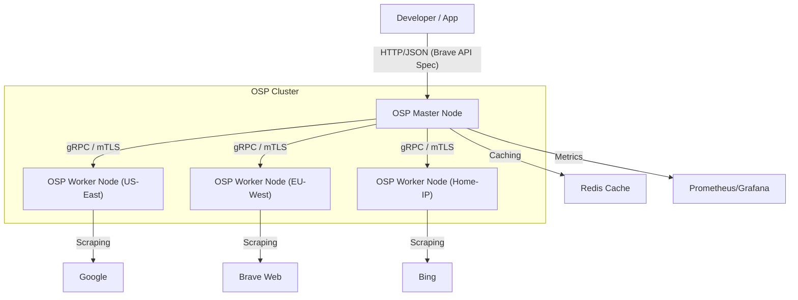

# Master Plan: GOSP (OSP)

## 1. Executive Summary
This document outlines the multi-phase engineering roadmap for the GOSP (OSP). OSP aims to disrupt the search API market by creating a distributed, community-powered network of search scrapers. The plan focuses on building a resilient, high-performance protocol in Go that can replace the Brave Search API as an industry standard.

---

## 2. Architecture Diagram (Conceptual)

---

## 3. Phased Roadmap

### Phase 1: Foundation & The Protobuf (The "Seed" Phase)
**Objective:** Define the core protocol and build a working local MVP.
- **Detailed Tasks:**
    - **Protobuf Design:** Create `proto/search.proto` defining `SearchRequest`, `SearchResponse`, and the `SearchService` gRPC service.
    - **Go Project Layout:** Establish the standard directory structure.
    - **Brave API Structs:** Implement a `pkg/brave` package that handles serialization/deserialization to match the Brave API JSON exactly.
    - **Engine Scrapers:** Implement the first Go scraper engine (e.g., using `net/http` and `goquery` for parsing HTML).
    - **Local Mock Master:** A simple `main.go` in `cmd/master` that can accept an HTTP query and return a local scrape result.
- **KPI:** Successful `curl` to a local Go server returning valid search JSON from a live engine.

### Phase 2: Distributed Core (The "Network" Phase)
**Objective:** Establish the Master-Worker communication layer.
- **Detailed Tasks:**
    - **gRPC Server (Master):** Implement the `SearchService` on the Master node.
    - **gRPC Client (Worker):** Implement the worker logic to connect to the Master.
    - **Registry Service:** An in-memory store in the Master to keep track of worker status (IP, metadata, engine support).
    - **Scheduler v1:** Basic round-robin task assignment to available workers.
    - **Worker Heartbeats:** A background goroutine in the worker to ping the master every 30 seconds.
- **KPI:** Master managing 3 local worker processes simultaneously and routing tasks correctly.

### Phase 3: Reliability & Performance (The "Scale" Phase)
**Objective:** Hardening the protocol for real-world usage.
- **Detailed Tasks:**
    - **Task Retries:** If a worker returns an error or times out, the Master must re-assign the task to a different worker.
    - **Aggregator Logic:** Implement deduplication by URL and basic relevance scoring.
    - **Redis Integration:** Use Redis to cache search results (key: hashed query + params, value: JSON response).
    - **Circuit Breaking:** Use a library like `gobreaker` to prevent sending tasks to consistently failing workers.
    - **Metrics Exporting:** Integrate `prometheus/client_golang` to expose metrics at `/metrics`.
- **KPI:** P95 latency under 1,500ms with a 10-worker cluster.

### Phase 4: Decentralization & Security (The "Hardening" Phase)
**Objective:** Secure the network and enable P2P discovery.
- **Detailed Tasks:**
    - **mTLS Implementation:** Generate certificates and implement mTLS in both gRPC client and server.
    - **Libp2p Integration:** Replace direct IP connections with `libp2p` for NAT traversal and peer discovery.
    - **Reputation Scoring:** Implement a module to track worker performance (latency, error rate, result accuracy).
    - **Rate Limiting:** Global rate limiting at the Master API using a token bucket algorithm.
    - **Docker Hub / GHCR:** Set up automated builds for multi-arch Docker images.
- **KPI:** Successful worker connection from behind a home firewall without manual port forwarding.

### Phase 5: Ecosystem & Standardization (The "Standard" Phase)
**Objective:** Full Brave API parity and public release.
- **Detailed Tasks:**
    - **Brave API v1 Full Parity:** Support all sub-objects (news, images, videos) in the response.
    - **OSP CLI Pro:** A powerful management tool for banning nodes, viewing live traffic, and cluster configuration.
    - **Developer SDKs:** Initial Go and TypeScript client libraries for OSP.
    - **Public Status Page:** A web dashboard showing total nodes, average latency, and uptime.
    - **External Audit:** A technical review of the scraping logic and protocol security.
- **KPI:** Used as a drop-in replacement in at least 3 third-party applications.

---

## 4. Module Breakdown (Deep Dive)

### 4.1 Master Node (`internal/master`)
- **API Handler:** High-performance HTTP server (using Fiber).
- **Worker Manager:** Tracks worker health and metadata.
- **Dispatcher:** The "brain" that assigns tasks based on worker engine support and current load.
- **Result Processor:** Aggregates, ranks, and serializes the final response.

### 4.2 Worker Node (`internal/worker`)
- **Node Client:** Handles the gRPC connection lifecycle.
- **Scraper Pool:** Manages multiple scraper engines concurrently.
- **Browser Service (Optional):** Wrapper for `chromedp` instances.
- **Health Reporter:** Periodic reporting of CPU/RAM/Network stats.

---

## 5. Deployment Strategy

### 5.1 Master Node (VPS/Cloud)
- **Environment:** Ubuntu 22.04 LTS.
- **Service:** Managed via `systemd` or Docker Compose.
- **Networking:** Ports 80/443 (API) and 50051 (gRPC) open.

### 5.2 Worker Node (Residential/Home)
- **Environment:** Raspberry Pi, Windows, or macOS.
- **Service:** Lightweight Docker container or a single static binary.
- **Networking:** No port forwarding required (post-Phase 4 libp2p).

---

## 6. Security Threat Model

| Threat | Description | Mitigation |
| :--- | :--- | :--- |
| **Sybil Attack** | Attacker joins with many nodes to control results. | Reputation system + IP-based registration limits. |
| **Data Tampering** | Malicious worker modifies results. | Consensus (sending same query to 3 workers). |
| **Eavesdropping** | Third-party intercepts Master-Worker traffic. | Mandatory mTLS / TLS 1.3. |
| **Resource Abuse** | Master sends too many tasks to a home worker. | Hard-coded worker-side rate limits + master scheduler. |

---

## 7. Success Metrics (KPIs)
- **Cluster Growth:** Targeting 100+ active worker nodes in month 1.
- **Uptime:** Master node 99.9% availability.
- **Result Accuracy:** 95% similarity to official Brave Search API results.
- **Developer Adoption:** 10+ GitHub stars and 3+ external contributors within month 2.
